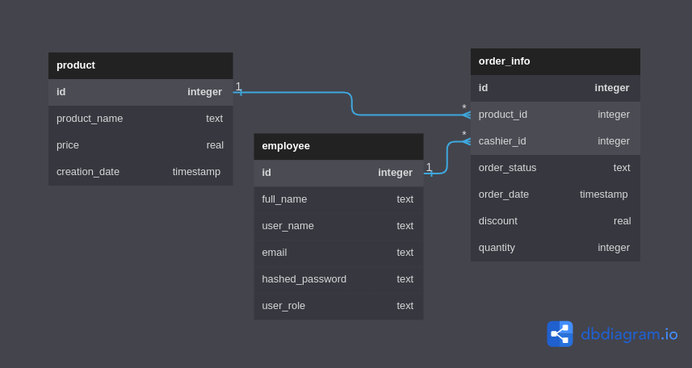

# Database structure
[Main page](../README.md)

## Products
|product_id|name|price|creation_date|
|---|---|---|---|
|1|Laptop|1000|2023-05-30|
|2|Smartphone|800|2023-05-29|
|3|TV|1500|2023-05-28|

## Employees
|employee_id|name|role|email|password|
|---|---|---|---|---|
|1|John Doe|cashier|[johndoe@example.com](mailto:johndoe@example.com)|hashed_password|
|2|Jane Smith|sales|[janesmith@example.com](mailto:janesmith@example.com)|hashed_password|
|3|David Johnson|accountant|[davidjohnson@example.com](mailto:davidjohnson@example.com)|hashed_password|

## Orders
| id  | product_id | cashier_id | order_status | order_date          | discount | quantity |
| --- | ---------- | ---------- | ------------ | ------------------- | -------- | -------- |
| 1   | 100        | 500        | "completed"  | 2023-06-14 10:23:45 | 0.1      | 2        |
| 2   | 101        | 501        | "pending"    | 2023-06-14 11:45:18 | 0.0      | 1        |
| 3   | 102        | 502        | "completed"  | 2023-06-14 14:12:36 | 0.2      | 3        |
| 4   | 103        | 503        | "paid"       | 2023-06-14 15:30:59 | 0.1      | 2        |
| 5   | 104        | 504        | "completed"  | 2023-06-14 17:55:21 | 0.0      | 1        |
